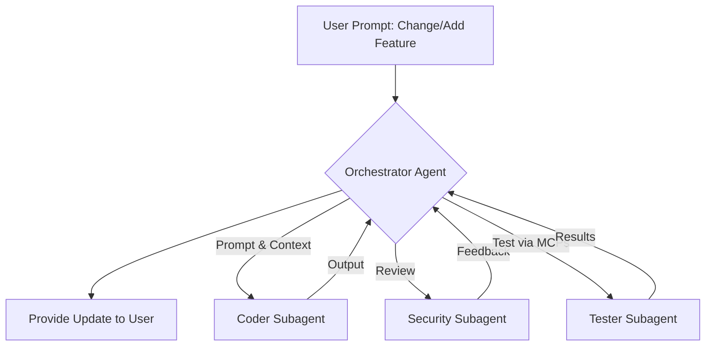

---
tags:
  - Writing
  - Systems
date: 2026-10-09
title: Creating an Diet Tracker + Helper app with openCode!
description: You know, most diet tracker apps are paid, lets try vibecoding to try and fix that!
cover:
image: images/opencode.png
---

Hey guys! Hyp-n here! So, today, we are going to use openCode, an agentic harness, to make an Diet Tracker App! So, don't worry this is more of a hands-on tutorial, I'm not going to spoonfeed you, you're going to be doing most of the stuff.

# Requirements:
- Install openCode, connect it to openrouter

## Using an AI orchestrator along with subagents.

